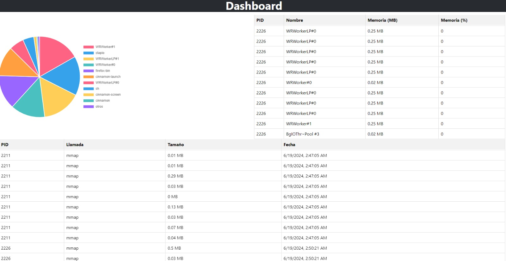

# Manejo de Memoria
SO2 Proy1 1V24 Grupo 21
- 201612174 - Alberto Gabriel Reyes Ning
- 201900462 - Xhunik Nikol Miguel Mutzutz

## Objetivos

- Entender cómo funcionan el manejo de memoria en Linux.
- Comprender cómo funcionan las solicitudes de memoria de los procesos.
- Realizar reportes sobre la utilización de memoria.

## Descripción

La gestión de la memoria es un aspecto crítico del rendimiento del sistema, ya que garantiza la utilización eficiente de los recursos y mantiene la estabilidad bajo diferentes cargas de trabajo. Al monitorear exhaustivamente la memoria, se puede obtener información valiosa sobre el comportamiento del sistema, identificar posibles cuellos de botella y optimizar la asignación de recursos.

En este proyecto se creó una aplicación capaz de monitorear el uso de memoria de cada proceso abierto en Linux, detectando las solicitudes de memoria que estos realizan al sistema operativo.

## Especificaciones

### Arquitectura

#### Script SystemTap

El script de SystemTap se encarga de capturar las solicitudes de memoria de todos los procesos activos. Estas solicitudes son realizadas por medio de las siguientes llamadas al sistema:

- `void *mmap(void addr[.length], size_t length, int prot, int flags, int fd, off_t offset);`
- `int munmap(void addr[.length], size_t length);`

`mmap()` crea una nueva asignación en el espacio de direcciones virtuales del proceso de llamada. La dirección inicial para la nueva asignación se especifica en `addr`. El argumento de `length` especifica la longitud del mapeo (que debe ser mayor que 0).

La llamada al sistema `munmap()` elimina las asignaciones para el rango de direcciones especificado. 

La captura de estas llamadas se realiza por medio de un script de SystemTap, que es una herramienta para la instrumentación dinámica para sistemas operativos basados en Linux por el cual los administradores del sistema pueden extraer, filtrar y resumir datos para permitir el diagnóstico de problemas complejos de rendimiento o funcionales.

Cada vez que `mmap()` o `munmap()` sean llamadas por algún proceso, el script deberá obtener los datos necesarios para realizar un análisis del uso de memoria (PID, longitud del segmento de memoria, fecha de la solicitud, etc.).

```systemtap
probe syscall.mmap2 {
    printf("PID:%d,Proceso:%s,mmap:%lu bytes\n",
        pid(), execname(), length)
}

probe syscall.munmap {
    printf("PID:%d,Proceso:%s,munmap:%lu bytes\n",
        pid(), execname(), length)
}
```

### Lector
Este será un programa en C que estará leyendo el output del script de SystemTap. Cada vez que el módulo de kernel escriba una nueva solicitud, este programa deberá ser capaz de leerlo y subir esta llamada a una base de datos de MySQL.

Se deberá almacenar como mínimo la siguiente información:

- PID del proceso.
- Nombre del proceso.
- Llamada.
- Tamaño del segmento de memoria solicitado o liberado.
- Fecha y hora de la solicitud.


La función log_to_db tiene como objetivo registrar en una base de datos MySQL la información sobre las solicitudes de memoria capturadas por el script de SystemTap. A continuación se presenta una explicación detallada de cada parte de la función.


```C
void log_to_db(const char *pid, const char *name, const char *call, long size, const char *timestamp) {
    MYSQL *conn;
    conn = mysql_init(NULL);
    if (conn == NULL) {
        fprintf(stderr, "mysql_init() failed\n");
        return;
    }

    if (mysql_real_connect(conn, "192.168.191.1", "vmuser", "1234", "memory_monitor", 0, NULL, 0) == NULL) {
        fprintf(stderr, "mysql_real_connect() failed: %s\n", mysql_error(conn));
        mysql_close(conn);
        return;
    }

    if (mysql_query(conn, "USE memory_monitor")) {
        fprintf(stderr, "USE memory_monitor failed: %s\n", mysql_error(conn));
        mysql_close(conn);
        return;
    }

    char query[512];
    snprintf(query, sizeof(query), 
             "INSERT INTO memory_log (pid, process_name, call_type, memory_size, timestamp) VALUES ('%s', '%s', '%s', %ld, '%s')",
             pid, name, call, size, timestamp);

    if (mysql_query(conn, query)) {
        fprintf(stderr, "INSERT failed: %s\n", mysql_error(conn));
    } else {
        printf("Data inserted successfully\n");
    }

    mysql_close(conn);
}
```

La función main del programa memory_reader.c es la encargada de leer la salida del script de SystemTap, parsear la información y luego registrar estos datos en la base de datos MySQL. A continuación se presenta una explicación detallada de cada parte de la función.

```C
int main() {
    FILE *fp;
    char line[256];

    fp = popen("sudo stap /usr/local/bin/memory_script.stp", "r");
    if (fp == NULL) {
        perror("Failed to run SystemTap script");
        return 1;
    }

    while (fgets(line, sizeof(line), fp) != NULL) {
        char pid[10], name[255], call[10], timestamp[20];
        long size;

        printf("Raw line: %s\n", line);

        int parsed_items = sscanf(line, "PID:%9[^,],Proceso:%254[^,],%9[^:]:%ld bytes", pid, name, call, &size);
        printf("Parsed items: %d\n", parsed_items);
        printf("pid: %s, name: %s, call: %s, size: %ld\n", pid, name, call, size);

        if (parsed_items == 4) {
            get_current_timestamp(timestamp, sizeof(timestamp));
            printf("Parsed data - timestamp: %s, pid: %s, name: %s, call: %s, size: %ld\n", timestamp, pid, name, call, size);

            char *endptr;
            long pid_value = strtol(pid, &endptr, 10);
            if (*endptr == '\0') {
                log_to_db(pid, name, call, size, timestamp);
            } else {
                fprintf(stderr, "Invalid PID: %s\n", pid);
            }
        } else {
            fprintf(stderr, "Failed to parse line: %s\n", line);
        }
    }

    pclose(fp);
    return 0;
}
```

### Dashboard
Esta será una aplicación web donde el usuario podrá visualizar información del uso de memoria.

En este dashboard el usuario deberá ser capaz de ver una tabla donde se podrá leer:

- PID del proceso.
- Nombre del proceso.
- Cantidad de memoria que posee el proceso (mmap - munmap, debido a que el programa no se corre en startup puede que el resultado sea negativo, por lo que se deberá mostrar 0).
- Porcentaje al que equivale la memoria del proceso al total de memoria virtual del sistema.

Así mismo, se agregará una gráfica de pie donde se muestre qué porcentaje de toda la memoria solicitada fue realizada por cada proceso. Aquí deberán mostrar un máximo de 10 procesos; en caso de haber más, serán agrupados en una sección de “otros”.



### API en GO

La estructura MemoryLog define cómo se representan los registros de memoria en la aplicación. Cada campo de la estructura está anotado con etiquetas JSON para facilitar la serialización y deserialización de datos. A continuación se describen cada uno de los campos:

``` golang
type MemoryLog struct {
	PID           int     `json:"pid"`
	ProcessName   string  `json:"process_name"`
	CallType      string  `json:"call_type"`
	MemorySize    int64   `json:"memory_size"`
	MemorySizeMB  float64 `json:"memory_size_mb"`
	MemorySizePer float64 `json:"memory_size_per"`
	Timestamp     string  `json:"timestamp"`
}
```
La función main configura y arranca el servidor HTTP de la aplicación Go. Se inicializa un router con gorilla/mux, se configura CORS para permitir solicitudes desde el origen del frontend, se define una ruta para obtener los registros de memoria y finalmente se inicia el servidor en el puerto 8080. Esta configuración permite que la API maneje las solicitudes entrantes y proporcione datos a los clientes de manera eficiente y segura.

``` golang
func main() {
	router := mux.NewRouter()
	cors := handlers.CORS(handlers.AllowedHeaders([]string{"Content-Type"}), handlers.AllowedMethods([]string{"GET", "POST", "PUT", "DELETE"}), handlers.AllowedOrigins([]string{"http://localhost:3000"}))
	router.HandleFunc("/api/memorylogs", getMemoryLogs).Methods("GET")

	port := "8080" 
	fmt.Printf("Server running on port %s...\n", port)
	log.Fatal(http.ListenAndServe(":8080", cors(router)))
}
```

La función dbConn es una parte crítica de la API en Go, ya que se encarga de establecer y devolver una conexión a la base de datos MySQL utilizando los parámetros de configuración definidos. Esta conexión se puede reutilizar en varias partes de la aplicación para interactuar con la base de datos de manera eficiente y segura. La función también maneja posibles errores al intentar abrir la conexión, garantizando que cualquier problema se registre y detenga la ejecución del programa adecuadamente.

``` golang
func dbConn() (db *sql.DB) {
	db, err := sql.Open("mysql", fmt.Sprintf("%s:%s@tcp(%s:%s)/%s", dbUser, dbPassword, dbHost, dbPort, dbName))
	if err != nil {
		log.Fatal(err)
	}
	return db
}
```
La función getMemoryLogs es responsable de manejar las solicitudes GET para obtener los registros de uso de memoria desde la base de datos y devolverlos en formato JSON. La función establece una conexión a la base de datos, ejecuta una consulta para obtener los registros, itera sobre los resultados, calcula tamaños de memoria en megabytes y porcentajes, serializa los datos a JSON y envía la respuesta HTTP. Esto permite que los datos de uso de memoria sean accesibles para los clientes que consumen la API.

``` golang
func getMemoryLogs(w http.ResponseWriter, r *http.Request) {
	db := dbConn()
	defer db.Close()

	rows, err := db.Query("SELECT pid, process_name, call_type, memory_size, timestamp FROM memory_log ORDER BY timestamp DESC LIMIT 100")
	if err != nil {
		log.Fatal(err)
	}
	defer rows.Close()

	var memoryLogs []MemoryLog

	for rows.Next() {
		var memLog MemoryLog
		err := rows.Scan(&memLog.PID, &memLog.ProcessName, &memLog.CallType, &memLog.MemorySize, &memLog.Timestamp)
		if err != nil {
			log.Fatal(err)
		}

		memLog.MemorySizeMB = float64(memLog.MemorySize) / (1024.0 * 1024.0)
		memLog.MemorySizeMB = math.Round(memLog.MemorySizeMB*100) / 100

		memLog.MemorySizePer = (float64(memLog.MemorySize) / 8289133824) * 100
		memLog.MemorySizePer = math.Round(memLog.MemorySizePer*100) / 100

		memoryLogs = append(memoryLogs, memLog)
	}

	jsonData, err := json.Marshal(memoryLogs)
	if err != nil {
		log.Fatal(err)
	}

	w.Header().Set("Content-Type", "application/json")
	w.WriteHeader(http.StatusOK)
	w.Write(jsonData)
}
```

### Frontend - ReactJS

El componente MemoryLogs se encarga de obtener los registros de uso de memoria desde la API y actualizar la interfaz de usuario periódicamente con los datos más recientes. Utiliza el hook useState para gestionar el estado de los registros y el hook useEffect para realizar la solicitud inicial y configurar actualizaciones periódicas. La función fetchLogs utiliza axios para hacer una solicitud GET a la API y actualizar el estado con los datos obtenidos. Este enfoque asegura que la interfaz de usuario siempre muestre los datos más actualizados de manera eficiente.

``` js
//log.js 

const MemoryLogs = () => {
    const [logs, setLogs] = useState([]);
  
    const fetchLogs = () => {
      axios.get('http://localhost:8080/api/memorylogs')
        .then(response => {
          setLogs(response.data);
        })
        .catch(error => {
          console.error('Error fetching data:', error);
        });
    };
  
    useEffect(() => {
      fetchLogs(); 
      const interval = setInterval(fetchLogs, 15000); 
  
      return () => clearInterval(interval); 
    }, []);
```

El componente PieChart procesa los datos de uso de memoria y los prepara para visualizarlos en un gráfico de pastel. Se acumulan los tamaños de memoria para cada proceso, se ordenan en orden descendente, se seleccionan los 10 procesos principales y se agrupa el resto en una categoría "otros". Este enfoque permite visualizar claramente cómo se distribuye el uso de memoria entre los procesos más importantes y el resto.

```js
//chart.js 

ChartJS.register(ArcElement, Tooltip, Legend);

const PieChart = ({ data }) => {
  const processData = () => {
    const processMemory = {};

    data.forEach(log => {
      if (processMemory[log.process_name]) {
        processMemory[log.process_name] += log.memory_size_mb;
      } else {
        processMemory[log.process_name] = log.memory_size_mb;
      }
    });

    const sortedProcesses = Object.entries(processMemory).sort((a, b) => b[1] - a[1]);

    const topProcesses = sortedProcesses.slice(0, 10);
    const otherProcesses = sortedProcesses.slice(10);

    const otherMemory = otherProcesses.reduce((acc, curr) => acc + curr[1], 0);

    const labels = [...topProcesses.map(process => process[0]), 'otros'];
    const memorySizes = [...topProcesses.map(process => process[1]), otherMemory];
```